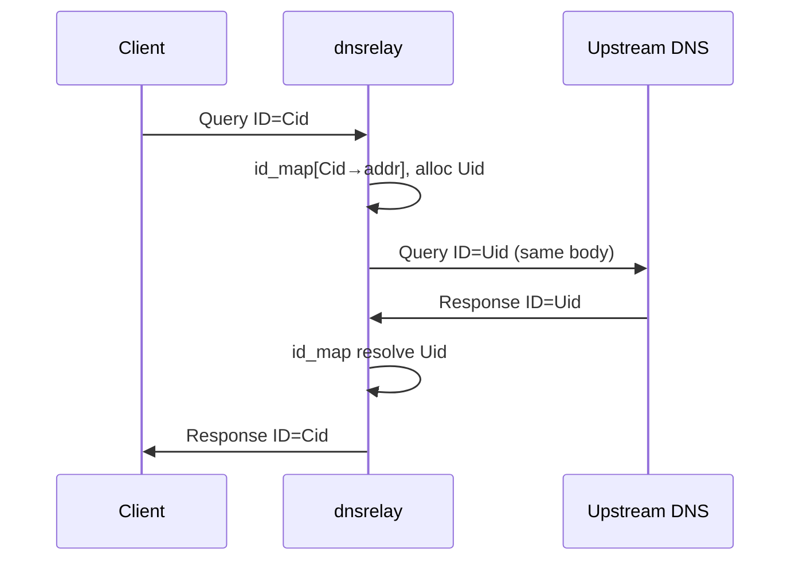

# DNS Relay 技术设计说明书（TDD）

| 字段 | 内容 |
|------|------|
| **文档版本** | v2.0 |
| **状态** | 已定稿 |
| **日期** | 2026-05-18 |
| **需求基线** | [design.md](./design.md) PRD v2.0 |
| **决策基线** | [decisions.md](./decisions.md) ADR-000～009 |
| **编码规范** | [coding-style.md](./coding-style.md) |

---

## 0. 文档目的与追溯

### 0.1 目的

本文描述 **dnsrelay** 的实现架构、协议处理、模块接口与核心数据结构，供开发、代码评审与答辩使用。产品行为与验收标准以 PRD 为准；本文不重复用户场景叙述。

### 0.2 术语（实现侧）

| 术语 | 含义 |
|------|------|
| **客户端报文** | `recvfrom` 自客户端 socket 地址收到的 UDP 载荷 |
| **上游报文** | 发往/发自 `upstream_addr` 的 UDP 载荷 |
| **本地合成** | 由本程序构造的 DNS 响应（非转发） |
| **中继** | 修改 ID 后转发，不改 Question/Answer 语义 |
| **pending** | 已转发上游、尚未收到应答或超时的中继事务 |

---

## 1. 系统上下文与约束

### 1.1 上下文图

```text
                    ┌─────────────────────────────────────┐
                    │           运行 dnsrelay 的 PC        │
  LAN 客户端        │  ┌─────────┐      ┌──────────────┐  │
  (UDP/53) ────────►│  │ Winsock │◄────►│ relay_loop   │  │
                    │  │ UDP :53 │      │ + id_map     │  │
                    │  └─────────┘      │ + dns_table  │  │
                    │                   └──────┬───────┘  │
                    └──────────────────────────┼──────────┘
                                               │ UDP/53
                                               ▼
                                        上游 DNS (配置 IP)
```

### 1.2 技术约束（摘要）

| 约束 | 来源 | 设计影响 |
|------|------|----------|
| Windows x64, C11, CMake+MinGW | ADR-000/001 | `platform_win.c`，链接 `ws2_32` |
| 单 UDP socket | ADR-003 | 同一 `SOCKET` 对客户端/上游 `sendto` |
| 入站/转发 ≤512 B | ADR-007, FR-08 | `DNS_UDP_BUF_SIZE=512` |
| 上游超时静默 | ADR-005, FR-07 | 不构造 SERVFAIL |
| 本地应答 AA=0 | ADR-006, FR-03/04 | `dns_packet` 组头时清 AA |
| 非 A/IN 仅中继 | ADR-004, FR-06 | `relay` 分支提前判断 |
| 无第三方库 | ADR-001 | 自实现哈希表、LRU 链表 |

### 1.3 假设与依赖

- 实验网络允许访问配置的上游 DNS（UDP/53 未被防火墙阻断）。
- 进程以管理员权限绑定 53；本机未占用 53 的其他服务（如 IIS、部分 DNS 代理）已停止。
- 客户端遵循常见 DNS UDP 行为；本设计 **不实现** TCP fallback、EDNS 大包。

---

## 2. 逻辑架构

### 2.1 分层

| 层 | 模块 | 职责 |
|----|------|------|
| **入口** | `main` | 初始化、加载配置、调用 `relay_run`、清理 |
| **控制** | `config`, `debug` | 命令行、运行时参数、分级日志 |
| **业务** | `relay` | 事件循环、报文分发、调用表/缓存/中继 |
| **协议** | `dns_packet` | 头/Question 解析、本地响应构造 |
| **数据** | `dns_table`, `dns_cache`, `id_map` | 静态表、LRU、pending 事务 |
| **传输** | `socket_io`, `platform` | UDP I/O、Winsock 生命周期 |

### 2.2 模块依赖（编译期）

```text
main
 └── config, platform, debug, relay
relay
 └── socket_io, id_map, dns_packet, dns_table [R2+], dns_cache [R3], debug, config
dns_table
 └── (internal hash_table) — 仅 dns_table.c 内可见
dns_cache
 └── (internal hash + LRU list) — 仅 dns_cache.c 内可见
```

### 2.3 部署与进程模型

- **单进程、单线程**（事件驱动）：避免锁；pending 与 socket 仅在 `relay_loop` 线程访问。
- **无守护进程/服务框架**：前台运行，Ctrl+C 退出（`SIGINT` / `WSACtrlHandler` 可选）。

---

## 3. 协议与报文设计

### 3.1 使用的 RFC 1035 结构

#### 3.1.1 报头（12 字节，网络字节序）

| 偏移 | 字段 | 本程序用法 |
|------|------|------------|
| 0–1 | ID | 中继：客户端 ID ↔ `upstream_id` 替换 |
| 2 | QR, OPCODE, AA, TC, RD | 本地合成：QR=1；AA=0；其余尽量沿用请求 |
| 3 | RA, Z, RCODE | NXDOMAIN：RCODE=3；A 应答：RCODE=0 |
| 4–5 | QDCOUNT | 本地响应：与请求一致（通常 1） |
| 6–7 | ANCOUNT | A 应答：≥1；NXDOMAIN：0 |
| 8–11 | NSCOUNT, ARCOUNT | 本地响应：0 |

#### 3.1.2 Question 段

- **QNAME**：长度标签序列，以 `0` 结束；支持 **消息压缩指针**（`11xxxxxx` + 14 位偏移）解析。
- **QTYPE / QCLASS**：主机序读取后判断；`QTYPE_A=1`，`QCLASS_IN=1`。

#### 3.1.3 本地 A 记录 Answer（合成）

- NAME：常用 **指针** `0xC00C` 指向 Question 中 QNAME（偏移 12）。
- TYPE=A(1), CLASS=IN(1), TTL=配置常量（如 60）, RDLENGTH=4, RDATA=IPv4。

### 3.2 三条数据路径与报文修改范围

| 路径 | 触发条件 | 报文处理 |
|------|----------|----------|
| **本地 A** | R2：表 HIT 且非 0.0.0.0，QTYPE=A, QCLASS=IN | **新建**响应缓冲；不转发 |
| **本地 NXDOMAIN** | R2：表 BLOCK(0.0.0.0)，QTYPE=A, QCLASS=IN | **新建**响应；RCODE=3，无 Answer |
| **中继** | R1+：其余所有合法查询/响应 | 拷贝缓冲；**仅改 byte[0..1] 的 ID** |

### 3.3 512 字节策略（ADR-007）

| 方向 | 条件 | 动作 |
|------|------|------|
| 客户端 → 本机 | `len > 512` | 丢弃，`debug` 可选告警 |
| 本机 → 客户端（合成） | 编码后 `> 512` | 实现必须避免（简化 QNAME/Answer） |
| 上游 → 本机 | `len > 512` | 丢弃，不转发客户端 |
| 本机 → 上游 | 转发前已保证 ≤512 | — |

---

## 4. 运行时模型

### 4.1 事件循环（`relay_run`）

```text
loop:
  计算 select 超时 = min(下一个 pending 过期时间, RELAY_SELECT_MAX_MS)
  select(socket_fd, readfds, timeout)
  if socket_readable:
      recvfrom → 根据 src_addr 判断：
          if src == 客户端（非 upstream 端口/地址）:
              handle_client_query(buf, len, src)
          else if src == upstream:
              handle_upstream_response(buf, len)
  id_map_expire(now)   // 删除过期 pending，不回包
```

**客户端/上游区分**：保存 `upstream_addr`（`sockaddr_in`）；`recvfrom` 后比较源地址与端口（53）及 IP 是否匹配上游；不匹配则视为客户端。

### 4.2 客户端查询处理（`handle_client_query`）

```text
if len > 512: return
if !dns_packet_parse_query(...): return   // 日志

// Release 2+
if qtype==A && qclass==IN:
    r = resolve_local(qname)   // table → [cache R3] → miss
    if HIT:  build A → sendto client; return
    if BLOCK: build NXDOMAIN → sendto client; return

relay_forward(buf, len, client_id, client_addr)
```

### 4.3 中继转发（`relay_forward`）

```text
upstream_id = id_map_alloc(client_id, client_addr, qname_opt)
copy buf → out_buf
set_header_id(out_buf, upstream_id)
sendto(upstream_addr, out_buf, len)
```

### 4.4 上游应答（`handle_upstream_response`）

```text
if len > 512: return
id = get_header_id(buf)
entry = id_map_take(id)    // 查找并删除
if !entry: return          // 迟到/未知 ID，丢弃
set_header_id(buf, entry.client_id)
sendto(entry.client_addr, buf, len)
```

### 4.5 时序（中继）



---

## 5. 模块设计与接口

约定：**返回值** `0` 成功，`<0` 错误（模块内枚举或统一 `dns_relay_error`）。

### 5.1 `platform` — `include/platform.h`

| 函数 | 说明 |
|------|------|
| `int platform_init(void)` | `WSAStartup(2,2)` |
| `void platform_cleanup(void)` | `WSACleanup` |
| `uint64_t platform_monotonic_ms(void)` | 毫秒单调时钟（超时） |

### 5.2 `config` — `include/config.h`

```c
#define DNS_RELAY_DEFAULT_UPSTREAM   "202.106.0.20"
#define DNS_RELAY_DEFAULT_TABLE_PATH "dnsrelay.txt"
#define DNS_RELAY_DEFAULT_PORT       53

typedef struct dns_relay_config {
    char     upstream_ip[46];     /* 点分十进制 */
    uint16_t upstream_port;       /* 默认 53 */
    char     table_path[512];     /* R2+ */
    int      debug_level;         /* 0, 1(-d), 2(-dd) */
    int      load_table;          /* R1:0, R2:1 */
} dns_relay_config;

int config_parse(int argc, char **argv, dns_relay_config *out);
void config_set_defaults(dns_relay_config *cfg);
```

| 函数 | 前置 | 后置 |
|------|------|------|
| `config_parse` | `out` 非 NULL | 填充 `out`；非法参数打印 stderr 并返回负值 |

### 5.3 `socket_io` — `include/socket_io.h`

```c
typedef struct dns_socket {
    SOCKET              fd;
    struct sockaddr_in  bind_addr;      /* 0.0.0.0:53 */
    struct sockaddr_in  upstream_addr;
} dns_socket;

int  dns_socket_open(dns_socket *sock, const dns_relay_config *cfg);
void dns_socket_close(dns_socket *sock);
int  dns_socket_recv(dns_socket *sock, uint8_t *buf, size_t cap,
                     struct sockaddr_storage *from, socklen_t *from_len);
int  dns_socket_sendto(dns_socket *sock, const uint8_t *buf, size_t len,
                       const struct sockaddr_storage *to, socklen_t to_len);
```

- `dns_socket_recv`：返回接收字节数；`0` 不用于 UDP；错误返回 `<0`。
- 内部设置 `SO_REUSEADDR`（若需要）及非阻塞 **否**——使用 `select` 阻塞等待，避免忙等。

### 5.4 `dns_packet` — `include/dns_packet.h`

```c
#define DNS_TYPE_A    1
#define DNS_CLASS_IN  1

typedef struct dns_query_info {
    uint16_t id;
    uint16_t qtype;
    uint16_t qclass;
    char     qname[256];          /* 规范化：小写、无末尾点 */
    size_t   qname_encoded_len;   /* Question 中 QNAME 占用字节 */
    size_t   question_end_offset; /* 相对报文头 12 后首字节 */
} dns_query_info;

int dns_packet_parse_query(const uint8_t *pkt, size_t len, dns_query_info *out);

int dns_packet_build_a_response(const dns_query_info *q,
                                const uint8_t *req_pkt, size_t req_len,
                                uint32_t ipv4_be,          /* 网络序 */
                                uint8_t *out, size_t out_cap, size_t *out_len);

int dns_packet_build_nxdomain(const dns_query_info *q,
                              const uint8_t *req_pkt, size_t req_len,
                              uint8_t *out, size_t out_cap, size_t *out_len);

uint16_t dns_packet_get_id(const uint8_t *pkt);
void     dns_packet_set_id(uint8_t *pkt, uint16_t id);
```

| 函数 | 错误场景 |
|------|----------|
| `dns_packet_parse_query` | `len<12`、QDCOUNT!=1（可选宽松）、QNAME 越界、压缩环 |
| `dns_packet_build_*` | `out_cap` 不足返回 `<0` |

**QNAME 解码**：迭代标签；遇压缩指针跳转，**最大跳转次数**防环（如 16）。

### 5.5 `dns_table` — `include/dns_table.h`（Release 2+）

```c
typedef enum dns_table_result {
    DNS_TABLE_MISS = 0,
    DNS_TABLE_HIT,           /* 普通 IPv4 */
    DNS_TABLE_BLOCK          /* 0.0.0.0 */
} dns_table_result;

typedef struct dns_table dns_table;

dns_table *dns_table_create(size_t bucket_count);  /* 建议 1024+ */
void       dns_table_destroy(dns_table *t);

int dns_table_load_file(dns_table *t, const char *path);
    /* 逐行解析 IP+域名；覆盖重复键；返回加载条数或 <0 */

dns_table_result dns_table_lookup(const dns_table *t, const char *qname,
                                uint32_t *ipv4_out);  /* HIT 时写网络序 */
```

**内部结构**（`dns_table.c` 私有）：

```c
typedef struct dns_table_entry {
    char              *name;       /* 堆分配，小写 */
    uint32_t           ipv4;       /* 网络序；0.0.0.0 表示 BLOCK */
    struct dns_table_entry *next;  /* 链地址法 */
} dns_table_entry;

struct dns_table {
    dns_table_entry **buckets;
    size_t            bucket_count;
    size_t            size;
};
```

**哈希**：djb2 / FNV-1a 对 `qname`；`index = hash % bucket_count`。

### 5.6 `id_map` — `include/id_map.h`（Release 1+）

```c
#define DNS_ID_MAP_TIMEOUT_MS  5000
#define DNS_ID_MAP_MAX_PENDING 256   /* 可配置 */

typedef struct id_map id_map;

id_map *id_map_create(void);
void    id_map_destroy(id_map *m);

/* 分配新 upstream_id，插入 pending；失败返回负值 */
int id_map_insert(id_map *m, uint16_t client_id,
                  const struct sockaddr_storage *client_addr, socklen_t client_len,
                  const char *qname_optional, uint16_t *upstream_id_out);

/* 按 upstream_id 查找并移除；未找到返回 NULL */
typedef struct id_map_entry {
    uint16_t                   client_id;
    uint16_t                   upstream_id;
    struct sockaddr_storage    client_addr;
    socklen_t                  client_len;
    uint64_t                   expire_at_ms;
    char                       qname[256];  /* 可选，-dd 用 */
} id_map_entry;

id_map_entry *id_map_take(id_map *m, uint16_t upstream_id);

/* 删除 expire_at_ms <= now 的条目；返回删除数量 */
size_t id_map_expire(id_map *m, uint64_t now_ms);

/* 计算距最近过期的毫秒，供 select 使用；无 pending 返回 RELAY_SELECT_MAX_MS */
uint64_t id_map_next_expire_ms(const id_map *m, uint64_t now_ms);
```

**upstream_id 分配**：单调递增 `uint16_t`（跳过 0），插入前 probing；与已有 pending 冲突则继续 +1。

**索引结构**：链地址哈希表，`hash(upstream_id) % buckets`，或开放定长数组（pending 上限 256 时数组即可）。

### 5.7 `dns_cache` — `include/dns_cache.h`（Release 3）

```c
typedef struct dns_cache dns_cache;

dns_cache *dns_cache_create(size_t capacity);
void       dns_cache_destroy(dns_cache *c);

typedef enum dns_cache_lookup_result {
    DNS_CACHE_MISS = 0,
    DNS_CACHE_HIT,
    DNS_CACHE_EXPIRED
} dns_cache_lookup_result;

dns_cache_lookup_result dns_cache_lookup(dns_cache *c, const char *qname,
                                         uint32_t *ipv4_out, uint64_t now_ms);

int dns_cache_insert(dns_cache *c, const char *qname, uint32_t ipv4_be,
                     uint32_t ttl_sec, uint64_t now_ms);
```

**LRU**：哈希定位节点 + 双向链表（`list_head` 风格）；超容量淘汰尾节点；`expire_at` 到期的条目视为 MISS 并删除。

### 5.8 `relay` — `include/relay.h`

```c
int relay_run(const dns_relay_config *cfg);
```

持有 `dns_socket`、`id_map`、可选 `dns_table`/`dns_cache`，进入 §4 事件循环。

### 5.9 `debug` — `include/debug.h`

```c
void debug_init(int level);
void debug_log(int level, const char *fmt, ...);
#define DBG_L1 1
#define DBG_L2 2
```

- L1：时间、序号、client IP、qname、动作（local/relay/timeout）。
- L2：包长、Cid/Uid、RCODE、表查找结果。

### 5.10 `main` — `src/main.c`

```text
platform_init → config_parse → [dns_table_load R2] → dns_socket_open
→ relay_run → dns_socket_close → dns_table_destroy → platform_cleanup
```

---

## 6. 本地解析链（Release 2/3）

```text
dns_table_lookup(qname)
  → HIT/BLOCK: return
dns_cache_lookup(qname)          // R3 only
  → HIT: return
return MISS → relay_forward
```

**中继成功后插入 cache（R3）**：`handle_upstream_response` 在 `sendto` 客户端前，若 `dns_packet` 能从响应解析出与 Question 匹配的 A 记录，则 `dns_cache_insert`（失败忽略）。

---

## 7. 常量汇总

| 宏 | 值 | 说明 |
|----|-----|------|
| `DNS_UDP_BUF_SIZE` | 512 | 收发缓冲 |
| `DNS_RELAY_PORT` | 53 | 监听端口 |
| `DNS_ID_MAP_TIMEOUT_MS` | 5000 | FR-07 |
| `DNS_LOCAL_TTL` | 60 | 本地 A 应答 TTL |
| `DNS_TABLE_DEFAULT_BUCKETS` | 2048 | 约 900 项负载因子 |
| `DNS_CACHE_DEFAULT_CAPACITY` | 256 | R3 |
| `RELAY_SELECT_MAX_MS` | 500 | 无 pending 时 select 上限 |

---

## 8. 错误处理

| 场景 | 对用户可见行为 | 内部处理 |
|------|----------------|----------|
| 表文件打不开（R2） | 启动失败，stderr 提示 | `main` 返回非 0 |
| 表行无效 | 无 | 跳过，DEBUG 计数 |
| 解析失败 | 无应答 | 丢弃包 |
| `id_map` 满 | 无应答 | 返回错误，DEBUG；可选丢弃新查询 |
| 上游超时 | 客户端自行超时 | `id_map_expire`，不发包 |
| 迟到上游应答 | 无 | `id_map_take` 失败，丢弃 |

**不实现**：向客户端发送 SERVFAIL；向上游替客户端重试。

---

## 9. 目录与构建

```text
dns_relay/
  CMakeLists.txt          # 目标 dnsrelay，链接 ws2_32，-std=c11
  include/*.h
  src/*.c
  samples/dnsrelay-minimal.txt
```

**Release 编译**：可用 `DNS_RELAY_RELEASE=1|2|3` 宏控制是否编译 `dns_table.c` / `dns_cache.c`（或始终编译，R1 不调用）。

---

## 10. 安全与性能

| 项 | 说明 |
|----|------|
| **放大攻击** | 课设不专门防护；绑定局域网实验环境 |
| **伪造上游** | 仅接受来自配置上游 IP:53 的应答（推荐校验 `recvfrom` 源） |
| **复杂度** | 表查找 O(1) 平均；`id_map` O(1)；过期扫描 O(pending) |
| **CPU** | 禁止空转；`select` 睡眠至事件或最近超时 |

---

## 11. Release 实现范围

| 模块/API | R1 | R2 | R3 |
|----------|----|----|-----|
| `platform`, `config`, `socket_io`, `debug` | ✓ | ✓ | ✓ |
| `relay` + 中继路径 | ✓ | ✓ | ✓ |
| `id_map` | ✓ | ✓ | ✓ |
| `dns_packet` parse | ✓ | ✓ | ✓ |
| `dns_packet` build A/NX | | ✓ | ✓ |
| `dns_table` | | ✓ | ✓ |
| `dns_cache` | | | ✓ |
| `config.load_table` | 0 | 1 | 1 |
| `resolve_local` | — | table | table→cache |

### 11.1 内部里程碑（开发排期）

| 编号 | 内容 |
|------|------|
| P1.0 | CMake、`platform`、`config`、`main` 骨架 |
| P1.1 | `dns_socket_open` bind |
| P1.2 | `id_map` + `relay_forward` / `handle_upstream_response` |
| P1.3 | `select` + expire |
| P1.4 | `dns_packet_parse_query` + debug |
| P2.0 | `dns_table_load_file` |
| P2.1 | `build_a` / `build_nxdomain` |
| P2.2 | `handle_client_query` 分支 + 验收 |
| P3.0–P3.1 | `dns_cache` 接入 |

---

## 12. PRD 需求追溯矩阵

| PRD | 技术实现 |
|-----|----------|
| FR-01 | `dns_socket_open` bind `0.0.0.0:53` |
| FR-02 | `dns_table_load_file`, 规范化/覆盖规则 |
| FR-03 | `dns_table` HIT + `dns_packet_build_a_response`, AA=0 |
| FR-04 | `DNS_TABLE_BLOCK` + `dns_packet_build_nxdomain` |
| FR-05 | `relay_forward` + `id_map` + `handle_upstream_response` |
| FR-06 | `handle_client_query` 非 A/IN 跳过表 |
| FR-07 | `id_map_expire`, `DNS_ID_MAP_TIMEOUT_MS` |
| FR-08 | 入口 `len>512` 丢弃；合成长度检查 |
| FR-09 | `config_parse` |
| FR-10 | `dns_cache_*`, R3 解析链 |
| NFR-01 | `select` 事件循环 |
| NFR-03 | 自实现哈希表/LRU |
| NFR-04 | 无客户端重传逻辑 |

---

## 13. 修订记录

| 版本 | 日期 | 说明 |
|------|------|------|
| v1.0 | 2026-05-18 | 初版概要 |
| v2.0 | 2026-05-18 | 网络工程师 skill 规范重写：协议、API、数据结构、时序、追溯矩阵 |
